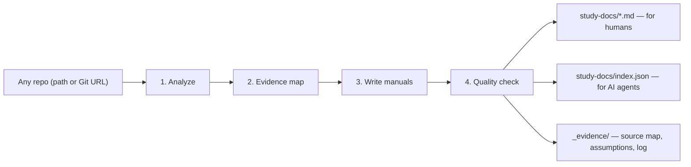

# tracedocs

**English** · [简体中文](README.zh-CN.md)

> **Generate trusted project docs from any codebase — a Claude Code skill.**

Point tracedocs at a local repo or Git URL. It creates a `study-docs/` package
with project overview, quickstart, deployment, architecture, API, data model,
troubleshooting, and maintenance docs — plus a machine-readable `index.json`
for AI agents.

Every important claim cites source evidence. If the repo does not prove a detail
(for example deployment), tracedocs records it as `Unknown` instead of guessing.


[](https://github.com/wxggzz/tracedocs/actions/workflows/validate.yml)
[](https://wxggzz.github.io/tracedocs/)

<p align="center">
  
</p>

**In plain English:** tracedocs turns a code repository into a maintainable
project handbook for onboarding humans, briefing AI coding agents, and handing
off operations without hallucinated steps.

## At A Glance

| Input | Output | Trust layer |
| --- | --- | --- |
| Local path or Git URL | Repo-native Markdown manuals in `study-docs/` | Source citations + `Verified` / `Inferred` / `Unknown` / `Needs confirmation` labels |
| Any codebase an agent can read | AI-ready `index.json` | Unknowns recorded in `_evidence/` instead of invented |

## How It Works



## What It Looks Like

Every operational claim carries its evidence and confidence — and gaps are stated
plainly instead of guessed:

| Claim | Evidence | Confidence |
| --- | --- | --- |
| `npm run dev` starts the app | `package.json` `scripts.dev` | Verified |
| Tests run with `pytest` | `pyproject.toml` dev deps + `tests/` | Verified |
| Deploys to a managed host | — | **Unknown — not documented in the repo** |

See [`examples/study-docs/`](examples/study-docs/) for a complete, validated
sample (the skill documenting this project's own CLI), or open the
[live demo](https://wxggzz.github.io/tracedocs/).

## Hallucination Test

Point tracedocs at a repo with **no** `Dockerfile`, deploy workflow, hosting
config, or deployment docs, then ask how to deploy it:

| Question | Generic AI docs often write | tracedocs writes |
| --- | --- | --- |
| "How do I deploy this?" | Plausible but invented steps like "push to main, CI builds a Docker image, deploy to AWS." | **No deployment configuration was found. Deployment is undocumented.** |

The sample output demonstrates this refusal in
[`03-deployment-manual.md`](examples/study-docs/03-deployment-manual.md) and
records the gap in
[`_evidence/assumptions.md`](examples/study-docs/_evidence/assumptions.md).

## Key Features

- **No-hallucination guarantee** — every operational/deployment claim cites a
  source file and a confidence label; it refuses to write steps it can't prove.
- **AI-ready** — ships a machine-readable `index.json` so agents can consume the
  docs, not just humans.
- **Lives in your repo** — durable Markdown that versions and diffs in PRs, not a
  one-off artifact.
- **Documents the gaps** — unknowns and assumptions go in `_evidence/`, never
  glossed over.
- **Works with any agent** — it's plain `SKILL.md` + references; Claude Code,
  Codex, and any coding agent that can read files can run it.

## Compatibility Matrix

| Agent | Install | Invoke |
| --- | --- | --- |
| Claude Code plugin | `/plugin marketplace add https://github.com/wxggzz/tracedocs` → `/plugin install tracedocs@tracedocs` | `/tracedocs:tracedocs` |
| Claude Code skill copy | Copy `SKILL.md` + `references/` to `~/.claude/skills/tracedocs/` | `/tracedocs` |
| Codex | Copy `SKILL.md` + `references/` to `~/.codex/skills/tracedocs/` | `use tracedocs to document ./my-app` |
| Other file-reading agents | Point the agent at `SKILL.md` + `references/` | Ask it to use the tracedocs workflow |

## Install

### Option A — Claude Code plugin (recommended)

Run these as **two separate** Claude Code messages:

```text
/plugin marketplace add https://github.com/wxggzz/tracedocs
```

```text
/plugin install tracedocs@tracedocs
```

Then invoke it as `/tracedocs:tracedocs` (Claude Code namespaces plugin skills
as `/<plugin>:<skill>`).

### Option B — Copy into your skills folder

Gives the shorter `/tracedocs` command, and is the way to use it from Codex or
any other agent that reads `SKILL.md`:

```bash
git clone https://github.com/wxggzz/tracedocs
# Claude Code:
mkdir -p ~/.claude/skills/tracedocs
cp -R tracedocs/SKILL.md tracedocs/references ~/.claude/skills/tracedocs/
# Codex (same idea):
mkdir -p ~/.codex/skills/tracedocs
cp -R tracedocs/SKILL.md tracedocs/references ~/.codex/skills/tracedocs/
```

Then **reload/restart** your agent — skills are discovered at startup. (Prefer a
live link during development? `ln -s "$(pwd)/tracedocs" ~/.claude/skills/tracedocs`.)

## Use

```text
/tracedocs           # copy install (Option B)
/tracedocs:tracedocs # plugin install (Option A)
use tracedocs to document ./my-app
```

Give it a local path, a Git URL (cloned to a temp dir), or nothing (uses the
current directory). Output lands in `study-docs/`.

### Try It In 30 Seconds

Paste this into Claude Code or Codex from any repository:

```text
Use tracedocs to generate evidence-grounded study docs for this repository.
Write the output to study-docs/.
```

## tracedocs vs codebase-to-course

Both are Claude Code skills that read a repo — they aim at different jobs.

| | [codebase-to-course](https://github.com/zarazhangrui/codebase-to-course) | **tracedocs** |
| --- | --- | --- |
| Output | Interactive HTML course | Repo-native Markdown **+ `index.json`** |
| Audience | Learners / non-technical | Engineers, operators, **AI agents** |
| Lifespan | One-off artifact | Versioned; diffs in PRs |
| Trust | Narrative explanation | Every claim cited + confidence + gaps |
| Use it when… | You want to *teach how the code works* | You want to *operate / deploy / maintain / hand off* |

It is an *AI-ready project knowledge base*: durable docs for onboarding,
operations, and AI-agent handoff.

## What It Produces

```text
study-docs/
  README.md                       # index + generation date + confidence notes
  index.json                      # machine-readable manifest (AI-ready)
  index.html                      # optional single-file preview (browse/screenshot)
  00-project-overview.md
  01-quickstart.md
  02-operation-manual.md
  03-deployment-manual.md
  04-learning-manual.md
  05-code-introduction.md
  06-architecture.md
  07-api-and-integrations.md
  08-data-model.md
  09-troubleshooting.md
  10-maintenance-and-contribution.md
  assets/                         # Mermaid diagrams (.mmd)
  _evidence/                      # source-map, assumptions, generation-log
```

See [`docs/output-document-map.md`](docs/output-document-map.md) for what each
file covers.

## Why Trust It

- **Evidence over invention.** Every operational/deployment claim cites its
  source and a confidence label (`Verified` / `Inferred` / `Unknown` /
  `Needs confirmation`).
- **Never invents deployment steps.** No deployment config in the repo? The docs
  say so — they don't guess.
- **Secrets stay secret.** Environment variables are documented by **name only**.
- **Gaps are documented**, in `_evidence/assumptions.md`, not glossed over.
- **AI-ready.** `index.json` gives agents a structured map of docs, commands,
  env-var names, confidence counts, and unknowns.

## Repository Layout

```text
tracedocs/
  SKILL.md                        # the skill: workflow + output contract
  references/
    analysis-checklist.md         # what to extract before writing
    markdown-style-guide.md       # formatting + evidence conventions
    handoff-protocol.md           # confidence labels + agent handoff
    templates/                    # one opinionated scaffold per output document
  .claude-plugin/marketplace.json # Claude Code plugin marketplace manifest
  plugins/tracedocs/              # plugin copy of the skill (see scripts/sync-plugin.sh)
  scripts/sync-plugin.sh          # copy root SKILL.md + references into the plugin
  prompts/generate-study-docs.md  # ready-to-paste invocation prompt
  docs/output-document-map.md     # what each generated document is for
  docs/visual-system.md           # visual tokens + preview component rules
  examples/study-docs/            # a complete, validated sample
```

## Deterministic CLI (optional)

Prefer a zero-dependency, offline run (e.g. in CI)? A Python CLI that produces
the same `study-docs/` layout deterministically lives on the
[`cli`](https://github.com/wxggzz/tracedocs/tree/cli) branch. The skill
above is the primary, recommended way to use this project.

## License

[MIT](LICENSE)
