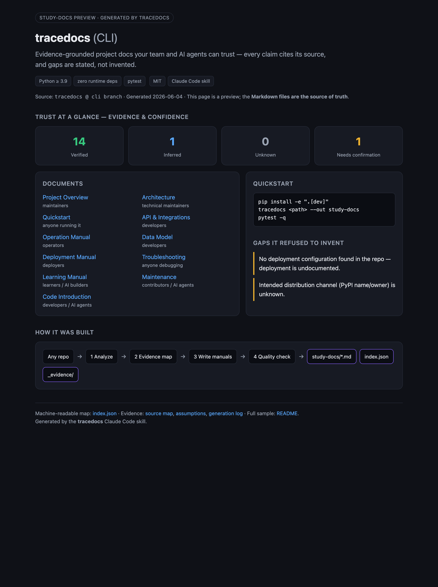
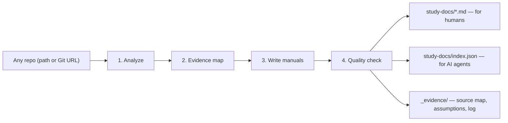

# tracedocs

> **Turn any codebase into evidence-grounded docs your team and AI agents can trust — a Claude Code skill.**

Every claim cites its source. It **never invents deployment steps**. Output is
Markdown **+ a machine-readable `index.json`** — AI-ready and living in your repo.


<p align="center">
  
</p>

**The problem:** AI doc generators hallucinate deployment steps and quietly go
stale. **tracedocs** generates documentation where every operational
claim is labelled `Verified` / `Inferred` / `Unknown` / `Needs confirmation` and
tied to the file it came from — and it *refuses* to write steps it can't source.

## How It Works



## What It Looks Like

Every operational claim carries its evidence and confidence — and gaps are stated
plainly instead of guessed:

| Claim | Evidence | Confidence |
| --- | --- | --- |
| `npm run dev` starts the app | `package.json` `scripts.dev` | Verified |
| Tests run with `pytest` | `pyproject.toml` dev deps + `tests/` | Verified |
| Deploys to a managed host | — | **Unknown — not documented in the repo** |

See [`examples/study-docs/`](examples/study-docs/) for a complete, validated
sample (the skill documenting this project's own CLI).

## Install (as a Claude Code skill)

```bash
git clone https://github.com/wxggzz/tracedocs
mkdir -p ~/.claude/skills/tracedocs
cp -R tracedocs/SKILL.md tracedocs/references ~/.claude/skills/tracedocs/
```

Then **reload/restart Claude Code** — skills are discovered at startup. (Prefer
a live link? `ln -s "$(pwd)/tracedocs" ~/.claude/skills/tracedocs`.)

## Use

```text
/tracedocs           # or: "use tracedocs to document ./my-app"
```

Give it a local path, a Git URL (cloned to a temp dir), or nothing (uses the
current directory). Output lands in `study-docs/`.

## tracedocs vs codebase-to-course

Both are Claude Code skills that read a repo — they aim at different jobs.

| | [codebase-to-course](https://github.com/zarazhangrui/codebase-to-course) | **tracedocs** |
| --- | --- | --- |
| Output | Interactive HTML course | Repo-native Markdown **+ `index.json`** |
| Audience | Learners / non-technical | Engineers, operators, **AI agents** |
| Lifespan | One-off artifact | Versioned; diffs in PRs |
| Trust | Narrative explanation | Every claim cited + confidence + gaps |
| Use it when… | You want to *teach how the code works* | You want to *operate / deploy / maintain / hand off* |

It is an *AI-ready project knowledge base*: durable docs for onboarding,
operations, and AI-agent handoff.

## What It Produces

```text
study-docs/
  README.md                       # index + generation date + confidence notes
  index.json                      # machine-readable manifest (AI-ready)
  index.html                      # optional single-file preview (browse/screenshot)
  00-project-overview.md
  01-quickstart.md
  02-operation-manual.md
  03-deployment-manual.md
  04-learning-manual.md
  05-code-introduction.md
  06-architecture.md
  07-api-and-integrations.md
  08-data-model.md
  09-troubleshooting.md
  10-maintenance-and-contribution.md
  assets/                         # Mermaid diagrams (.mmd)
  _evidence/                      # source-map, assumptions, generation-log
```

See [`docs/output-document-map.md`](docs/output-document-map.md) for what each
file covers.

## Why Trust It

- **Evidence over invention.** Every operational/deployment claim cites its
  source and a confidence label (`Verified` / `Inferred` / `Unknown` /
  `Needs confirmation`).
- **Never invents deployment steps.** No deployment config in the repo? The docs
  say so — they don't guess.
- **Secrets stay secret.** Environment variables are documented by **name only**.
- **Gaps are documented**, in `_evidence/assumptions.md`, not glossed over.
- **AI-ready.** `index.json` gives agents a structured map of docs, commands,
  env-var names, confidence counts, and unknowns.

## Repository Layout

```text
tracedocs/
  SKILL.md                        # the skill: workflow + output contract
  references/
    analysis-checklist.md         # what to extract before writing
    markdown-style-guide.md       # formatting + evidence conventions
    handoff-protocol.md           # confidence labels + agent handoff
    templates/                    # one opinionated scaffold per output document
  prompts/generate-study-docs.md  # ready-to-paste invocation prompt
  docs/output-document-map.md     # what each generated document is for
  examples/study-docs/            # a complete, validated sample
```

## Deterministic CLI (optional)

Prefer a zero-dependency, offline run (e.g. in CI)? A Python CLI that produces
the same `study-docs/` layout deterministically lives on the
[`cli`](https://github.com/wxggzz/tracedocs/tree/cli) branch. The skill
above is the primary, recommended way to use this project.

## License

[MIT](LICENSE)
