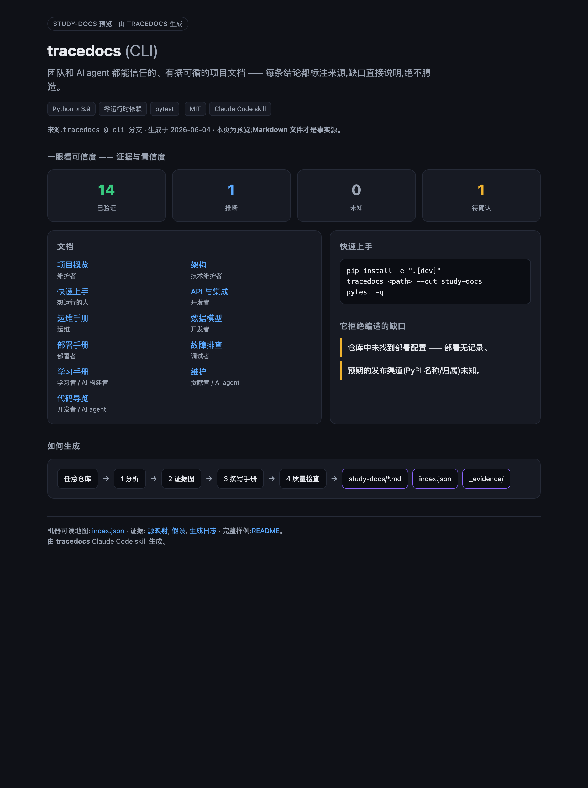
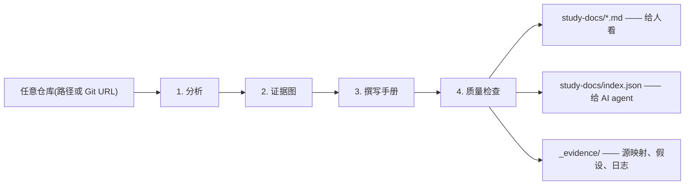

# tracedocs

[English](README.md) · **简体中文**

> **从任意代码库生成可信项目文档 —— 一个 Claude Code skill。**

把 tracedocs 指向本地仓库或 Git URL。它会生成 `study-docs/` 文档包:项目介绍、
快速上手、部署手册、架构说明、API、数据模型、排错和维护文档,并附带给 AI agent
读取的 `index.json`。

每条重要结论都会标注来源。仓库里没有证据的内容(比如部署方式)会记录为 `Unknown`,
不会猜。


[](https://github.com/wxggzz/tracedocs/actions/workflows/validate.yml)
[](https://wxggzz.github.io/tracedocs/)

<p align="center">
  
</p>

**一句话:** tracedocs 把代码仓库整理成一份可维护的项目说明书,用于新人上手、
AI agent 理解项目,以及运维/交接,但不会编造仓库里没有证据的步骤。

## 一眼看懂

| 输入 | 输出 | 可信层 |
| --- | --- | --- |
| 本地路径或 Git URL | `study-docs/` 里的仓库原生 Markdown 手册 | 来源引用 + `Verified` / `Inferred` / `Unknown` / `Needs confirmation` 标签 |
| 任何 agent 能读取的代码库 | 给 AI agent 使用的 `index.json` | 未知项写入 `_evidence/`,不编造 |

## 工作原理



## 长什么样

每条操作类结论都带证据和置信度 —— 缺口直接说明,而不是猜:

| 结论 | 证据 | 置信度 |
| --- | --- | --- |
| `npm run dev` 启动应用 | `package.json` `scripts.dev` | Verified |
| 用 `pytest` 跑测试 | `pyproject.toml` 开发依赖 + `tests/` | Verified |
| 部署到某托管平台 | — | **Unknown —— 仓库中无记录** |

完整、已校验的样例见 [`examples/study-docs/`](examples/study-docs/)(用本 skill
给本项目自己的 CLI 生成的文档),也可以直接打开
[在线 demo](https://wxggzz.github.io/tracedocs/)。

## 不幻觉测试

把 tracedocs 指向一个**没有** `Dockerfile`、部署工作流、托管平台配置、部署文档的仓库,
然后问它怎么部署:

| 问题 | 普通 AI 文档常见写法 | tracedocs 写法 |
| --- | --- | --- |
| "这个项目怎么部署?" | 看起来合理但其实编造的步骤,比如"推到 main 后 CI 构建 Docker 镜像并部署到 AWS"。 | **未发现部署配置。部署路径未记录。** |

样例输出在 [`03-deployment-manual.md`](examples/study-docs/03-deployment-manual.md)
里展示了这种拒绝编造,并把缺口记录在
[`_evidence/assumptions.md`](examples/study-docs/_evidence/assumptions.md)。

## 核心特性

- **不幻觉保证** —— 每条操作/部署结论都附来源文件和置信度标签;无法溯源的步骤,
  它拒绝写。
- **AI 友好** —— 附带机器可读的 `index.json`,让 agent 也能消费这套文档,而不只是人。
- **随仓库留存** —— 可版本化、在 PR 里 diff 的 Markdown,而非一次性产物。
- **缺口被记录** —— 未知项和假设都写进 `_evidence/`,绝不糊弄。
- **任意 agent 可用** —— 本质就是 `SKILL.md` + references;Claude Code、Codex
  以及任何能读文件的 coding agent 都能跑。

## 兼容矩阵

| Agent | 安装方式 | 调用方式 |
| --- | --- | --- |
| Claude Code 插件 | `/plugin marketplace add https://github.com/wxggzz/tracedocs` → `/plugin install tracedocs@tracedocs` | `/tracedocs:tracedocs` |
| Claude Code 复制安装 | 复制 `SKILL.md` + `references/` 到 `~/.claude/skills/tracedocs/` | `/tracedocs` |
| Codex | 复制 `SKILL.md` + `references/` 到 `~/.codex/skills/tracedocs/` | `use tracedocs to document ./my-app` |
| 其它可读文件的 agent | 让 agent 读取 `SKILL.md` + `references/` | 要求它使用 tracedocs workflow |

## 安装

### 方式 A —— Claude Code 插件(推荐)

在 Claude Code 里**分两条消息**执行:

```text
/plugin marketplace add https://github.com/wxggzz/tracedocs
```

```text
/plugin install tracedocs@tracedocs
```

然后用 `/tracedocs:tracedocs` 调用(Claude Code 把插件 skill 命名为
`/<插件>:<skill>`)。

### 方式 B —— 复制到 skills 目录

得到更短的 `/tracedocs` 命令,也是 Codex 等其它读取 `SKILL.md` 的 agent 的用法:

```bash
git clone https://github.com/wxggzz/tracedocs
# Claude Code:
mkdir -p ~/.claude/skills/tracedocs
cp -R tracedocs/SKILL.md tracedocs/references ~/.claude/skills/tracedocs/
# Codex(同理):
mkdir -p ~/.codex/skills/tracedocs
cp -R tracedocs/SKILL.md tracedocs/references ~/.codex/skills/tracedocs/
```

然后**重载/重启**你的 agent —— skill 在启动时被发现。(开发时想用软链?
`ln -s "$(pwd)/tracedocs" ~/.claude/skills/tracedocs`。)

## 使用

```text
/tracedocs           # 复制安装(方式 B)
/tracedocs:tracedocs # 插件安装(方式 A)
use tracedocs to document ./my-app
```

传入本地路径、Git URL(会克隆到临时目录),或什么都不传(用当前目录)。
产出写入 `study-docs/`。

### 30 秒试用

在任意仓库里,把这段粘进 Claude Code 或 Codex:

```text
Use tracedocs to generate evidence-grounded study docs for this repository.
Write the output to study-docs/.
```

## tracedocs 与 codebase-to-course

两者都是读取仓库的 Claude Code skill —— 但目标不同。

| | [codebase-to-course](https://github.com/zarazhangrui/codebase-to-course) | **tracedocs** |
| --- | --- | --- |
| 产出 | 交互式 HTML 课程 | 仓库原生 Markdown **+ `index.json`** |
| 受众 | 学习者 / 非技术 | 工程师、运维、**AI agent** |
| 生命周期 | 一次性产物 | 版本化;在 PR 里 diff |
| 可信度 | 叙述式讲解 | 每条结论有出处 + 置信度 + 缺口 |
| 何时用… | 想*讲清楚代码怎么运作* | 想*运维 / 部署 / 维护 / 交接* |

它是一个 *AI-ready 的项目知识库*:用于上手、运维和 AI agent 交接的可留存文档。

## 产出内容

```text
study-docs/
  README.md                       # 索引 + 生成日期 + 置信度说明
  index.json                      # 机器可读清单(AI 友好)
  index.html                      # 可选单文件预览(浏览/截图)
  00-project-overview.md
  01-quickstart.md
  02-operation-manual.md
  03-deployment-manual.md
  04-learning-manual.md
  05-code-introduction.md
  06-architecture.md
  07-api-and-integrations.md
  08-data-model.md
  09-troubleshooting.md
  10-maintenance-and-contribution.md
  assets/                         # Mermaid 图(.mmd)
  _evidence/                      # 源映射、假设、生成日志
```

每个文件的用途见 [`docs/output-document-map.md`](docs/output-document-map.md)。

## 为何可信

- **以证据为先,而非臆造。** 每条操作/部署结论都附来源和置信度标签(`Verified` /
  `Inferred` / `Unknown` / `Needs confirmation`)。
- **绝不编造部署步骤。** 仓库里没有部署配置?文档就如实说明 —— 不猜。
- **不泄密。** 环境变量只记录**名称**。
- **缺口被记录**在 `_evidence/assumptions.md`,不糊弄过去。
- **AI 友好。** `index.json` 给 agent 一份结构化地图:文档、命令、环境变量名、
  置信度统计、未知项。

## 仓库结构

```text
tracedocs/
  SKILL.md                        # 本 skill:工作流 + 输出契约
  references/
    analysis-checklist.md         # 写之前要提取什么
    markdown-style-guide.md       # 格式 + 证据规范
    handoff-protocol.md           # 置信度标签 + agent 交接
    templates/                    # 每个输出文档一个有观点的模板
  .claude-plugin/marketplace.json # Claude Code 插件市场清单
  plugins/tracedocs/              # 插件版的 skill 副本(见 scripts/sync-plugin.sh)
  scripts/sync-plugin.sh          # 把根目录 SKILL.md + references 同步进插件
  prompts/generate-study-docs.md  # 可直接粘贴的调用提示词
  docs/output-document-map.md     # 每个生成文档的用途
  docs/visual-system.md           # 视觉 token + 预览组件规则
  examples/study-docs/            # 一个完整、已校验的样例
```

## 确定性 CLI(可选)

想要零依赖、离线运行(比如放进 CI)?一个能确定性产出相同 `study-docs/` 结构的
Python CLI 在 [`cli`](https://github.com/wxggzz/tracedocs/tree/cli) 分支上。
上面的 skill 是推荐的主用法。

## 许可证

[MIT](LICENSE)
