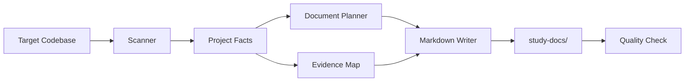

# Architecture Design

`tracedocs` should be designed as a documentation pipeline. The pipeline
can run as a Claude Code/Codex skill, a CLI, or both.

## Conceptual Pipeline



## Modules

### Scanner

The scanner reads the target repository and extracts factual signals:

- root files: README, LICENSE, package files, config files
- source tree shape
- build and run scripts
- dependency files
- environment variable names
- test files and commands
- deployment config
- API route files
- database schema files

The scanner should not try to deeply understand every line of code. It should
collect enough structured context for the writer.

### Project Facts

The scanner output should be normalized into a simple internal model:

```text
ProjectFacts
  name
  summary
  languages
  frameworks
  package_managers
  run_commands
  build_commands
  test_commands
  entry_points
  env_vars
  integrations
  data_stores
  deployment_signals
  important_files
  unknowns
```

### Evidence Map

Every important generated claim should be traceable to a source:

```text
Claim: The app is started with `npm run dev`.
Evidence: package.json scripts.dev
Confidence: verified
```

Confidence levels:

- `verified`: directly supported by a source file
- `inferred`: likely, but not directly stated
- `unknown`: missing or ambiguous

### Document Planner

The planner decides which documents apply. For example:

- If there are no API routes, skip API docs or mark them as not applicable.
- If there is no deployment config, write deployment assumptions instead of fake
  steps.
- If there are tests, document how to run them.

### Markdown Writer

The writer fills templates using project facts and evidence. It should preserve
template structure while adapting headings and sections to the target project.

### Quality Check

Before finishing, validate:

- all linked local paths exist
- all commands are sourced or marked as inferred
- no secret values are included
- Mermaid diagrams are syntactically simple
- skipped documents are explained

## Recommended MVP

Start with a Python CLI because it is easy to package, test, and run in agent
workflows.

The first version can be mostly deterministic. Later versions can add LLM-backed
summaries after the fact extraction is reliable.

## Future LLM Layer

The LLM should not scan raw files blindly. It should receive:

- project facts
- selected source excerpts
- evidence map
- template for the requested document

This keeps token use lower and makes handoff between Claude Code and Codex much
cleaner.

