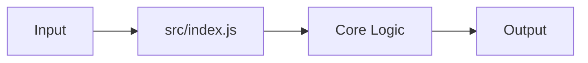

# Code Introduction

## Source Tree

```text
sample-node-app/
  src/
    index.js
  test/
    health.test.js
  .env.example
  Dockerfile
  package.json
  README.md
```

## Entry Points

| Path | Role | Evidence |
| --- | --- | --- |
| `src/index.js` | Node main module | `src/index.js` present |

## Main Modules

_Module responsibilities are inferred from the source tree above. Review the top-level source directories to confirm._

## Core Flow



## How To Change The Code Safely

- Identify the module responsible for the behavior.
- Check tests before editing.
- Make the smallest useful change.
- Run the relevant test command.
- Update documentation when behavior changes.
