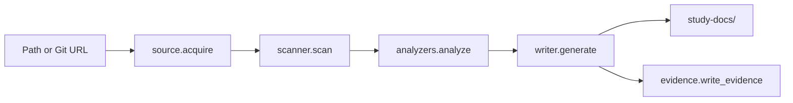

# Code Introduction

## Source Tree

```text
project_to_study/
  __init__.py      # version
  model.py         # dataclasses: ProjectFacts, Command, EnvVar, Route, Entity, Claim, Confidence
  scanner.py       # scan a repo -> ProjectFacts (+ collected Claims)
  analyzers.py     # extract API routes and data entities
  evidence.py      # write source-map / assumptions / generation-log
  templates.py     # document manifest + shared Markdown render helpers
  writer.py        # ProjectFacts -> the study-docs/ Markdown package
  validate.py      # check a generated package
  source.py        # local path or Git URL -> local directory
  style.py         # standard / concise / teaching / ops presets
  cli.py           # argparse entry point and dispatch
tests/             # pytest suite + fixtures
```

## Entry Points

| Path | Role | Evidence |
| --- | --- | --- |
| `tracedocs` (console script) | Installed command → `cli:main` | `pyproject.toml` `[project.scripts]` |
| `project_to_study/cli.py:main` | Parses args; bare path is treated as `generate` | `cli.py` `main()` |

## Main Modules

| Module | Responsibility | Approx. LOC |
| --- | --- | --- |
| `scanner.py` | Gather facts (languages, commands, env names, deploy signals, tests) | 714 |
| `writer.py` | Render the 11 manuals, README, diagrams, evidence wiring | 702 |
| `analyzers.py` | Extract routes and entities (incl. brace/paren-balanced scanners) | 410 |
| `model.py` | The dataclasses that everything passes around | 141 |
| `evidence.py` | Write the `_evidence/` trail | 109 |
| `cli.py` | Orchestrate the pipeline; subcommands `generate`/`validate` | 105 |
| `templates.py` | Doc manifest + table/heading/code helpers | 94 |
| `source.py` | Resolve local path or shallow-clone a Git URL | 83 |
| `validate.py` | Quality checks on generated output | 78 |
| `style.py` | Output style presets | 55 |

## Core Flow



## How To Change The Code Safely

- Identify the module that owns the behaviour (extraction → `scanner`/
  `analyzers`; rendering → `writer`/`templates`).
- Read the relevant test in `tests/` first.
- Make the smallest useful change; keep the standard library as the only runtime
  dependency.
- Run `pytest -q`, then regenerate sample output and `validate` it.
