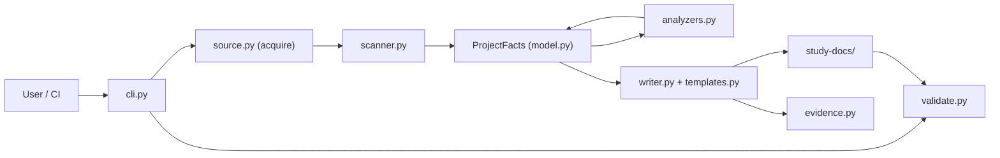

# Architecture

## System Boundary

Inside the project: a deterministic extraction-and-rendering pipeline that reads
a target repository and writes a Markdown package. Outside: the target codebase
(input) and, optionally, the `git` executable (used only to clone a Git URL).
There are no databases, network services, or runtime configuration.

## Component Diagram

## Data Flow

1. `cli.main` parses arguments; a bare path is treated as `generate`.
2. `source.acquire` yields a local directory (cloning a Git URL to a temp dir
   that is cleaned up afterwards).
3. `scanner.scan` walks the tree and builds a single `ProjectFacts` object,
   appending `Claim`s with evidence and confidence.
4. `analyzers.analyze` enriches the facts with routes and entities.
5. `writer.generate` renders the manuals from `templates`, and `evidence`
   writes the source map, assumptions, and generation log.
6. `validate` can later check the produced package.

## Dependencies

| Dependency | Purpose | Evidence |
| --- | --- | --- |
| Python standard library | All runtime logic (no third-party deps) | `pyproject.toml` `dependencies = []` |
| `git` (optional) | Shallow-clone a Git URL input | `source.py` `subprocess` |
| `pytest` (dev only) | Test runner | `pyproject.toml` dev extra |

## Architectural Decisions

- **Deterministic, no LLM**: output is repeatable and reviewable.
- **Zero runtime dependencies**: easy to install and run anywhere with Python.
- **Single in-memory model** (`ProjectFacts`) passed through the pipeline.
- **Heuristic extraction** with balanced-delimiter scanners for block schemas
  and decorator/argument parsing, to avoid fragile naive regex.

## Risks And Tradeoffs

- Regex/heuristic extraction is simpler than full parsing but can miss or
  over-match unusual code. Confidence: Inferred
- No LLM means narration is templated rather than deeply explanatory (by
  design; the skill form complements this). Confidence: Verified
