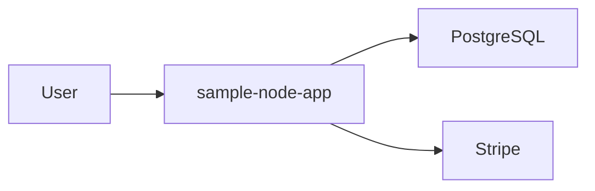

# Architecture

## System Boundary

What is inside this project and what external systems it depends on. External dependencies are inferred from declared packages.

## Component Diagram

## Data Flow

Data enters through the entry point(s), is processed by the core modules, and is persisted or returned. Confirm specifics against the source tree.

## Dependencies

| Dependency | Purpose | Evidence |
| --- | --- | --- |
| Express | Application framework | dependencies |
| PostgreSQL | Data persistence | dependencies/schema |
| Stripe | External integration | dependencies |

## Architectural Decisions

- Framework choice: Express.
- Data storage: PostgreSQL.
- Deployment style: Container image build (Docker).

## Risks And Tradeoffs

- No major architectural gaps detected.
