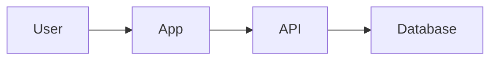

# Markdown Style Guide

Generated docs should be readable in GitHub, local editors, and AI-agent
contexts.

## General Rules

- Use clear headings.
- Prefer short paragraphs.
- Use tables for commands, env vars, and file maps.
- Use bullets for checklists.
- Use fenced code blocks for commands.
- Use Mermaid for diagrams.
- Explain assumptions explicitly.

## Evidence

When a document makes an operational or deployment claim, include a short
evidence note:

```text
Evidence: package.json `scripts.dev`
Confidence: Verified
```

For large docs, a local evidence note can be brief if the full source map exists
in `_evidence/source-map.md`.

## Commands

Format commands like this:

```bash
npm run dev
```

Do not invent commands. If a command is inferred, label it:

```text
Confidence: Inferred
```

## Environment Variables

List variable names, purpose, required/optional status, and evidence.

Never include real secret values.

## Diagrams

Use Mermaid when it makes the explanation clearer.

Keep diagrams simple:



## Tone

Write like a senior teammate:

- practical
- direct
- calm
- helpful
- honest about uncertainty

