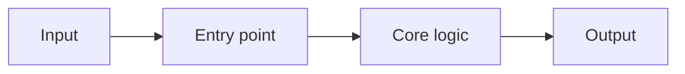

# Code Introduction

> Audience: developers and AI coding agents.
> Signature payoff: the source map, the entry points, and how data moves —
> enough to make a safe first change.

## Source Tree

```text
<summarized 2-level tree; collapse noise dirs like node_modules/.venv>
```

## Entry Points

| Path | Role | Evidence |
| --- | --- | --- |
| `<path>` | <e.g. CLI entry / HTTP app / worker> | <manifest field / file presence> |

## Main Modules

| Module | Responsibility |
| --- | --- |
| `<dir/file>` | <one line> |

## Core Flow



## How To Change The Code Safely

- Identify the module that owns the behaviour.
- Read the covering tests first.
- Make the smallest useful change.
- Run the relevant test command.
- Update docs (and `index.json`) when behaviour changes.
