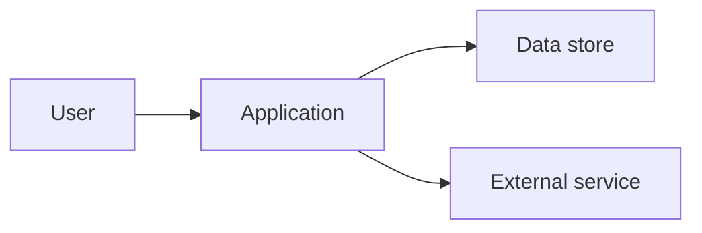

# Architecture

> Audience: technical maintainers.
> Signature payoff: a **component diagram** (Mermaid, required) and the **top 3
> risks** — not a wall of prose.

## System Boundary

<What is inside the project and which external systems it depends on. External
dependencies are inferred from declared packages unless stated otherwise.>

## Component Diagram

> Required. Adapt nodes/edges to the real components. Keep it simple and valid.

## Data Flow

<How data enters, is processed, and is persisted/returned. One short paragraph.>

## Dependencies

| Dependency | Purpose | Evidence |
| --- | --- | --- |
| `<dependency>` | <why it's here> | <manifest> |

## Architectural Decisions

<Decisions visible in the code: framework choice, state management, storage,
deployment style. Cite where each is evident.>

## Top 3 Risks

1. <Risk + why it matters + where it lives.>
2. <…>
3. <…>

> If fewer than three are evident, list what you found and mark the rest
> "None obvious (Inferred)." Do not pad with generic risks.
