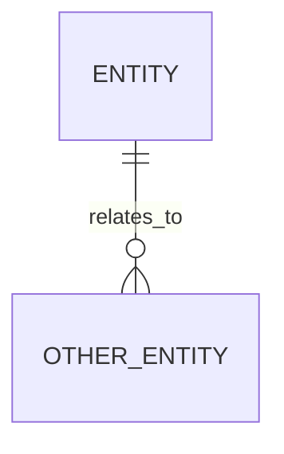

# Data Model

> Audience: developers, data maintainers, and AI coding agents.
> Signature payoff: a sourced map of durable state — databases, schemas, files,
> queues, caches — or an explicit "no persistent data model found."

## Storage Summary

Use one of these shapes.

**A) Persistent state found** — summarize the stores:

> Stores data in <database / files / object storage / queue / cache>.
> Evidence: <schema / migration / ORM model / config / dependency>
> Confidence: <Verified / Inferred>

**B) No persistent state found** — state it plainly:

> No database schema, migrations, ORM models, durable state files, or storage
> configuration were found in this repository.
> Confidence: Not applicable or Unknown — recorded in `_evidence/assumptions.md`.

## Entities

| Entity | Where defined | Important fields | Evidence | Confidence |
| --- | --- | --- | --- | --- |
| `<Entity>` | `<file>` | `<field names only>` | `<file>` | Verified |

> For schemas with many fields, list the fields that affect behaviour, identity,
> relationships, or user-visible data. Do not paste large generated schemas.

## Relationships

> Include this diagram only when relationships are evident. Otherwise write:
> "No entity relationships were evident from source."

## Migrations And Seeds

| Path | Purpose | Evidence |
| --- | --- | --- |
| `<migration or seed file>` | <what it changes/creates> | `<file>` |

## Configuration And Access

| Config name | Purpose | Required | Evidence |
| --- | --- | --- | --- |
| `DATABASE_URL` | <connection string name only> | Yes/No | `<file>` |

> List variable names only. Never include real connection strings, tokens, or
> credentials.

## Data Risks

- <Migration order, destructive operations, missing indexes, manual seed data,
  privacy-sensitive fields, or "None obvious (Inferred)".>

## Unknowns To Confirm

- <Production database type, retention, backup, migration owner, or other gaps.>
