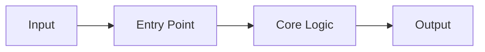

# Code Introduction

## Source Tree

```text
# Replace with summarized source tree
```

## Entry Points

| Path | Role | Evidence |
| --- | --- | --- |
| TBD | TBD | TBD |

## Main Modules

| Module | Responsibility |
| --- | --- |
| TBD | TBD |

## Core Flow



## How To Change The Code Safely

- Identify the module responsible for the behavior.
- Check tests before editing.
- Make the smallest useful change.
- Run the relevant test command.
- Update documentation when behavior changes.

